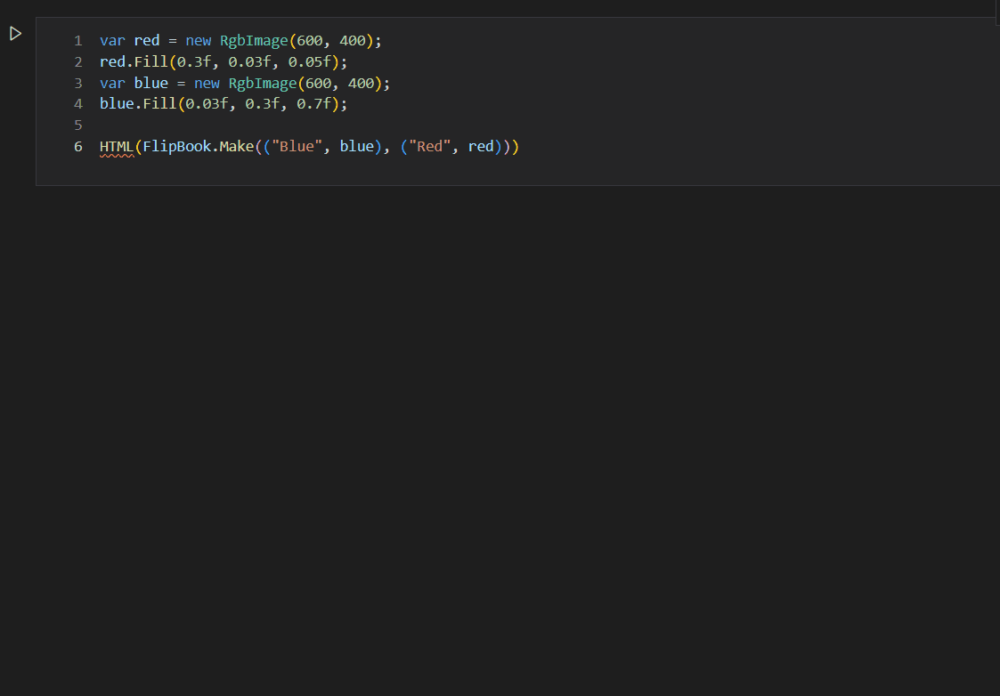

<a href="https://www.nuget.org/packages/SimpleImageIO/">

</a>

# Simple Image IO

A lightweight C# and Python wrapper to read and write RGB images from / to various file formats.
Supports .exr (with layers) via [tinyexr](https://github.com/syoyo/tinyexr) and a number of other formats (including .png, .jpg, and .bmp) via [stb_image](https://github.com/nothings/stb/blob/master/stb_image.h) and [stb_image_write](https://github.com/nothings/stb/blob/master/stb_image_write.h).
A subset of TIFF can be read and written via [tinydngloader](https://github.com/syoyo/tinydngloader).
We also implement our own importer and exporter for [PFM](http://www.pauldebevec.com/Research/HDR/PFM/).
In addition, the package offers some basic image manipulation functionality, error metrics, and tone mapping.

The C# wrapper further offers utilities for thread-safe atomic splatting of pixel values, and sending image data to the [tev](https://github.com/Tom94/tev) viewer via sockets. It also contains a very basic wrapper around [Intel Open Image Denoise](https://github.com/OpenImageDenoise/oidn).

The [**Nuget package**](https://www.nuget.org/packages/SimpleImageIO/) contains prebuilt binaries of the C++ wrapper for x86-64 Windows, Ubuntu, and macOS ([.github/workflows/build.yml](.github/workflows/build.yml)).
The [**Python package**](https://pypi.org/project/SimpleImageIO/) is set up to automatically download an adequate CMake version and compile the C++ code on any platform.

Except for the optional Intel Open Image Denoise, all dependencies are header-only and unintrusive, so this library should work pretty much anywhere without any hassle.

## Usage example (C#)

The following creates a one pixel image and writes it to various file formats:

```C#
RgbImage img = new(width: 1, height: 1);
img.SetPixel(0, 0, new(0.1f, 0.4f, 0.9f));
img.WriteToFile("test.exr");
img.WriteToFile("test.png");
img.WriteToFile("test.jpg");
```

Reading an image from one of the supported formats is equally simple:
```C#
RgbImage img = new("test.exr");
Console.WriteLine(img.GetPixel(0, 0).Luminance);
```

The pixel coordinate (0,0) corresponds to the top left corner of the image. Coordinates outside the valid range are clamped automatically; no error is raised. The framework also offers a `MonochromeImage` with a single channel per pixel. Further, the base class `ImageBase` can be used directly for images with arbitrary channel count (`RgbImage` and `MonochromeImage` only add some convenience functions like directly returning an `RgbColor` object).

As an added bonus, the C# wrapper can connect to the [tev](https://github.com/Tom94/tev) HDR viewer and directly display image data via sockets. The following example generates a monochrome image and sends it to tev:

```C#
TevIpc tevIpc = new(); // uses tev's default port on localhost

// Create the image and initialize a tev sync
MonochromeImage image = new(width: 20, height: 10);
tevIpc.CreateImageSync("MyAwesomeImage", 20, 10, ("default", image));

// Pretend we are a renderer and write some image data.
image.SetPixel(0, 0, val: 1);
image.SetPixel(10, 0, val: 2);
image.SetPixel(0, 9, val: 5);
image.SetPixel(10, 9, val: 10);

// Tell the TevIpc class to update the image displayed by tev
// (this currently retransmitts all pixel values)
tevIpc.UpdateImage("MyAwesomeImage");
```

## Usage example (Python)

The following creates a one pixel image, writes it to various file formats, reads one of them back in, and prints the red color channel of the pixel.
The result is then sent to the [tev](https://github.com/Tom94/tev) HDR viewer via sockets (modified version of https://gist.github.com/tomasiser/5e3bacd72df30f7efc3037cb95a039d3).

```Python
import simpleimageio as sio
sio.write("test.exr", [[[0.1, 0.4, 0.9]]])
sio.write("test.png", [[[0.1, 0.4, 0.9]]])
sio.write("test.jpg", [[[0.1, 0.4, 0.9]]])
img = sio.read("test.exr")
print(img[0,0,0])

with sio.TevIpc() as tev:
    tev.display_image("image", img)
    tev.display_layered_image("layers", { "stuff": img, "morestuff": img })
```

In Python, an image is a 3D row-major array, where `[0,0,0]` is the red color channel of the top left corner.
The convention is compatible with most other libraries that make use of numpy arrays for image representation, like matplotlib.

## Flip books for Jupyter and web

Both, the Python and the .NET library can generate an interactive HTML viewer to display and compare images visually by flipping between them. See [FlipBookExample.dib](FlipBookExample.dib) for an example with .NET interactive and C\#, [FlipBookExample.fsx](FlipBookExample.fsx) for a static webpage generator with F\#, or [flipbook.ipynb](flipbook.ipynb) for a Jupyter notebook with Python.



## Building from source

If you are on an architecture different from x86-64, you will need to compile the C++ wrapper from source.
Below, you can find instructions on how to accomplish that.

### Dependencies

All dependencies are header-only and included in the repository. Building requires
- a C++11 (or newer) compiler
- CMake
- [.NET 5.0](https://dotnet.microsoft.com/) (or newer)
- Python &geq; 3.6

### Building the C# wrapper on x86-64 Windows, Linux, or macOS

Build the C++ low level library with [CMake](https://cmake.org/):
```
mkdir build
cd build
cmake .. -DCMAKE_BUILD_TYPE=Release
cmake --build . --config Release
cd ..
```

Compile and run the tests (optional):
```
dotnet test
```

That's it. Simply add a reference to `SimpleImageIO/SimpleImageIO.csproj` to your project and you should be up and running.

#### MacOS and Open Image Denoise

The official Open Image Denoise binaries have the rpath set to `@executable_path/`. However, the `libtbb.12.dylib` file will be next to the `libOpenImageDenoise.1.dylib` and we do not know where that is relative to our executable. Therefore, we need to add `@loader_path/` to the rpath:

```
install_name_tool -add_rpath @loader_path/ libOpenImageDenoise.1.dylib
```

### Building the C# wrapper on other platforms

The [SimpleImageIO.csproj](SimpleImageIO/SimpleImageIO.csproj) file needs to copy the correct .dll / .so / .dylib file to the appropriate runtime folder.
Currently, the runtime identifiers (RID) and copy instructions are only set for the x86-64 versions of Windows, Linux, and macOS.
To run the framework on other architectures, you will need to add them to the .csproj file.
You can find the right RID for your platform here: [https://docs.microsoft.com/en-us/dotnet/core/rid-catalog](https://docs.microsoft.com/en-us/dotnet/core/rid-catalog).

Note that, currently, Open Image Denoise is included in binary from. The `Denoiser` class can therefore not be used on platforms other than x86-64 Windows, Linux, or macOS. Attempting to use it on other platforms will cause a `DllNotFound` exception.

Then, you should be able to follow the steps above and proceed as usual.

### Building the Python wrapper

Simply running:

```
python -m build
```

will automatically fetch an adequate version of CMake, compile the shared library, and build
the Python package.
You can then simply install the result via:

```
pip install ./dist/simpleimageio-*.whl
```

Where the * has to be substituted by the version number and the compiler and platform identifier (use auto-complete).

The tests can be run via:

```
cd PyTest
python -m unittest
```


